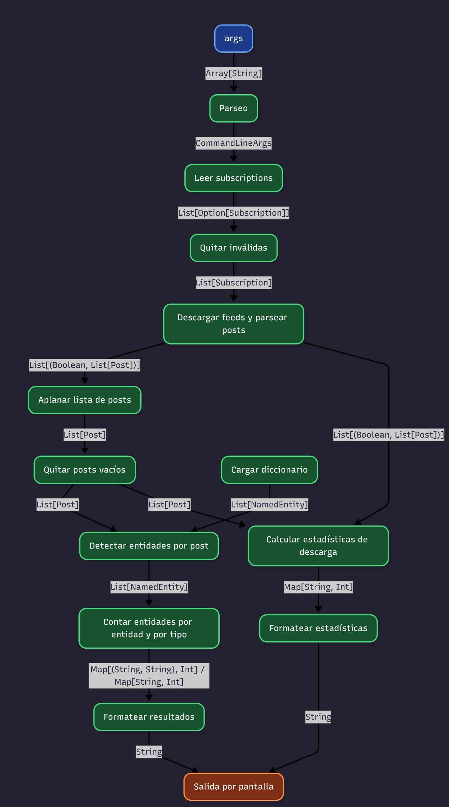
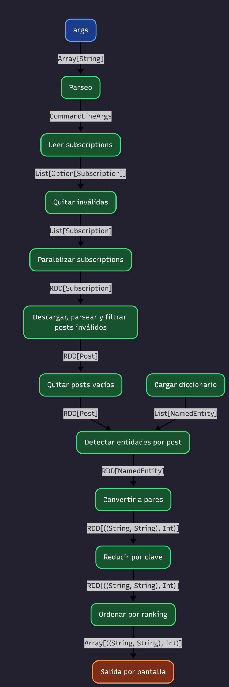
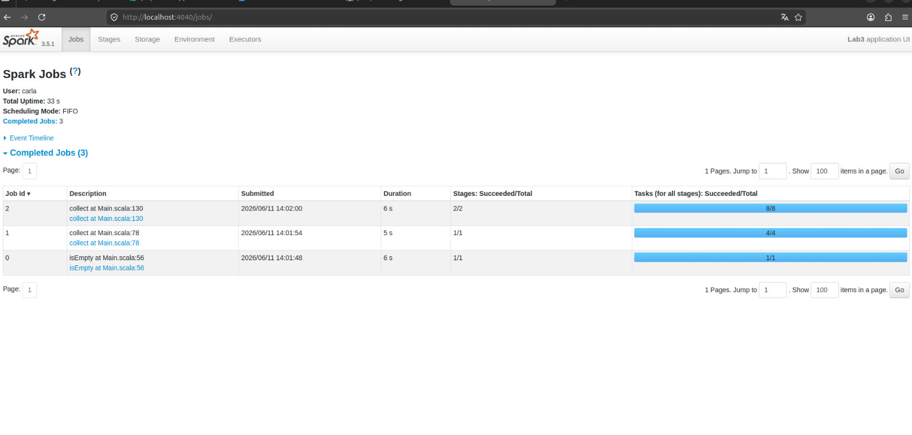

# EJERCICIO 1
## a) Dibujar un diagrama de flujo de los pasos que realiza el programa como un grafo de dependencias. Explicitar el tipo en Scala de cada conexión.

### Pipeline original (sin Spark)

### Pipeline distribuido con Spark
El programa tiene un pipeline casi secuencial, el driver inicializa SparK, carga los datos y luego distribuye el trabajo entre los workers.

  
## b) Para cada caso del pipeline, determinar si puede expresarse como unade las abstracciones de Spark. (map, flatMap, reduceByKey) 

La descarga y el parseo de feeds puede expresarse con flatMap, ya que cada subscription puede traer una cantidad variable de posts, varios si la descarga es exitosa o ninguno si ocurre un error.

La extraccion de las entidades tambien lo hace con flatMap, porque cada post puede tener cero, una o varias entidades.

La clasificacion de las entidades puede hacerse con map, ya que cada una se transforma en un resultado tipo ((entityType, text), 1)

El agrupar y llevar un conteo de cuantas veces aparece una entidad puede usar reduceByKey, agrupando con la misma clave (entityType, text) y sumando las ocurrencias.

El ranking de las identidades usariamos una operacion de ordenamiento como sortBy y esta es la que no encaja con map, flatMap ni reduceByKey ya que requiere comprar los resultados ibtenidos y ordenarlos segun su ocurrencia.

Por otro lado, la lectura del archivo de subscription, la creacion de la sesion de Spark y la impresion de los resultados tampoco encajan con las abstracciones ya que son tareas que realizar el driver y no transformaciones distribuidas sobre un RDD.

## c) Identificar que pasos del pipeline son barreras y cuales pueden ejecutarse de forma completamente independientes entre workers.

La etapa de descargas de feed, extraer las entidades y la clasificacion pueden ejecutarse de forma completamente independiente entre workers porque cada worker procesa elementos distintos sin necesidad de saber los resultados de los
otros.

El conteo con reduceByKey constituye una barrera de sincronizacion, porque es necesario agrupar y combinar las ocurrencias de una misma entidad proveniente de distintos workers antes de dar el resultado final.

La etapa de ranking tambien requiere una coordinacion global entre workers, ya que para ordenar las entidades es necesario disponer los conteos completos de la etapa anterior, por ende solo puede ejecutarse una vez finalizada los conteos anteriores.

## d)El mecanismo de extensión (extension point) de Spark es la función que el desarrollador le pasa a cada transformación. ¿Qué restricciones impone Spark sobre esas funciones para que puedan ejecutarse en un entorno distribuido? Piensen en serialización, estado compartido y efectos secundarios.

Las funciones utilizadas en transformaciones de Spark deben ser serializables, ya que Spark las envia desde el driver hacia los workers para su ejecucion distribuida. Ademas no deben depender de estado compartido mutable ya que cada worker ejecuta su copia independiente de la funcion y no existe memoria compartida entre ellos.

# EJERCICIO 2
## ¿Qué pasaría si dejaran propagar la excepción dentro del `flatMap`?

Si no manejamos la excepción con un bloque try/catch dentro del `flatMap`, el error (por ejemplo un timeout de red o un JSON malformado) se propaga al worker de Spark. Como Spark es tolerante a fallos, intenta reejecutar esa misma tarea fallida. Si el error persiste debido a que la URL efectivamente está caída o rota, Spark aborta por completo la etapa de ejecución y el Job entero se cancela.

Esto provoca que el programa finalice con error, perdiendo el procesamiento de todas las demás suscripciones de la lista que sí eran válidas. Al capturar la excepción localmente y devolver un iterador vacío (`Iterator.empty`), Spark asume que esa tarea no devolvió posts y continúa procesando el resto de las URLs en paralelo sin interrumpir el flujo principal.

# EJERCICIO 3
## reduceByKey es una barrera de sincronización. ¿Qué ocurre en el cluster en ese punto? ¿Por qué es inevitable para este problema?
Lo que tiene que hacer Spark es reunir todas las apariciones de una misma clave incluso si fue repartida entre distintos workers. Distintos posts pueden contener a la misma entidad (misma clave) y, como cada worker procesa posts distintos, pueden haber apariciones de entidades repartias entre varios workers. Por lo tanto, para obtener el conteo total, hay que si o si reunirlas a todas y sumarlas (es cuando hacemos el reduceByKey). Por eso la sincronizacion es inevitable.

## ¿Qué restricciones debe cumplir la función que se le pasa a reduceByKey? Piensen en conmutatividad y asociatividad.
Como Spark combina workers que, en el fondo, son threads diferentes, se puede generar indeterminismo con el output final si no se cumple que la operacion sea conmutativa y asociativa. Pues, si el orden afectase, entonces el resultado dependeria de el orden de ejecucion. Como en el reduceByKey hacemos una suma (_ + _) que es conmutativa y asociativa, no hay problema de hacer la reduccion distribuida.

## ¿Dónde se hace la lectura del diccionario de entidades? ¿En el driver o los workers?
La lectura se hace en el driver (con el Dictionary.loadAll). Despues, mediante la broadcast variable (la llamamos dicBroadcast), el diccionario se distribuye a los workers de manera eficiente. Luego, cada worker accede a el mediante dicBroadcast.value.
Esto se hace para evitar lecturas redundantes que pueden traer mayor costo de ejecucion.

# EJERCICIO 4
## Accumulators
Se incorporaron los siguiente accumulators al pipeline:
+ `feedsSuccess` -> cantidad de feeds descargados exitosamente.
+ `feedsFailed` -> cantidad de feeds que falló su descarga.
+ `postsDownloaded` -> cantidad total de posts descargados.
+ `postsDiscarded` -> cantidad de posts descartados por estar vacios o ser nulos.

## Medicion de tiempos
Medimos los tiempos con System.currentTimeMillis() antes y despues de cada accion terminal.

+ `isEmpty()` -> aprox 6 seg
+ `collect()` de posts -> aprox 5 seg
+ `collect()` del ranking -> aprox 6 seg

## Comparen el tiempo que tarda cada etapa del pipeline que midieron en la versión no paralelizada y la versión con Spark. ¿Qué conclusiones pueden sacar? Para la cantidad de datos que estamos trabajando, ¿se aprecia la diferencia? Justifique por qué. Nota: La comparación debe realizarse en ejecuciones sobre la misma computadora y la misma conexión a internet.
La comparacion entre la version secuencial y la version con Spark muestra tiempos similares. La version secuencial tardo aproximadamente 25 segundos, mientras que la version con Spark tardo aproximadamente 26 segundos.

La version actual con Spark (al tiempo del ejercicio 4) ejecuta varias acciones terminales (`isEmpty()` y dos llamadas a `collect()`), lo que provoca recomputaciones del pipeline al no utilizarse todavia cache(). Por eso no se observa una mejora significativa en esta prueba.

La version con Spark si paraleliza parte del trabajo, pero el volumen de datos es pequeño, se procesan pocos feeds y alrededor de 100 a 125 posts. Para este tamaño de entrada, el costo adicional de Spark (crear la sesion, planificar jobs, dividir el trabajo en stages y tasks, serializar datos y coordinar la ejecuciOn) puede compensar el beneficio de ejecutar tareas en paralelo. Spark resulta mas util cuando la cantidad de datos crece, cuando hay muchos feeds o cuando las etapas costosas del pipeline pueden distribuirse entre varios workers.

## Spark UI

En la pestaña Jobs de Spark UI se observaron tres jobs completados. Cada job corresponde a una accion terminal ejecutada en el programa. El primer job corresponde a la llamada a isEmpty(), utilizada para verificar si se descargaron posts validos. El segundo job corresponde al collect() que trae los posts descargados al driver. El tercer job corresponde al collect() final del conteo de entidades.

Esto muestra que Spark no ejecuta las transformaciones inmediatamente, sino recién cuando aparece una accion terminal.
Tambien se observa que los tres jobs tardan alrededor de 5 o 6 segundos. Ademas, como todavia no se usa cache(), Spark puede recomputar partes del pipeline en cada acción terminal.

## ¿Por qué los Accumulators solo deben usarse para métricas y no para tomar decisiones lógicas dentro de las etapas distribuidas del pipeline? ¿En qué situación un Accumulator puede dar un valor incorrecto?
Esto es porque los workers solo incrementan su valor y no tienen acceso a una version global y actualizada durante la ejecucion, el valor final es leido por el driver una vez que se completa una accion terminal. Puede producir valores incorrectos cuando Spark reejecuta tareas, por ejemplo cuando una tarea aumenta un accumulator y luego falla, debe ejecutarse nuevamente y ese incremento puede contabilizarse mas de una vez.

## ¿En qué momento del pipeline está disponible el valor de un Accumulator para ser leído por el driver?
Cuando los workers terminan sus tareas y se completa la accion terminal.

#EJERCICIO 5
## a) ¿Qué ocurriría si no llamaran a cache()? ¿Cuántas veces se ejecutaría la descarga de feeds?

Si no usamos `cache()`, Spark recomputa todo el pipeline desde el principio cada vez que llamamos a una acción, incluyendo las descargas HTTP. En nuestro código la descarga de feeds se ejecutaría tres veces: la primera cuando hacemos `downloadResults.isEmpty()`, la segunda al hacer `downloadResults.collect()`, y la tercera cuando llamamos a `entityCountsRDD.collect()`, ya que este requiere volver a calcular el RDD anterior del que depende.

## b) ¿Por qué es incorrecto llamar a collect() entre los pasos a) y b) del ejercicio 3 y luego continuar el pipeline? ¿Qué consecuencia tiene sobre la distribución del trabajo?

Es incorrecto porque la funcion collect se encarga de traer todos los datos obtenidos de los workers devuelta a la memoria del driver. La consecuencia de hacer esto a la mitad del pipeline es que se rompe completamente la paralelización. Todo el procesamiento siguiente se haría de forma secuencial en una sola maquina en vez de aprovechar el cluster, lo que genera un cuello de botella y puede hacer que el driver se quede sin memoria si los datos son muchos.

## c) cache() es también lazy. ¿En qué momento se almacena realmente el RDD en memoria?

Como la funcion `cache()` es lazy, el RDD recién se va a materializar en la memoria de los workers cuando el programa ejecute la primera accion sobre ese RDD. En el caso de nuestro pipeline, se almacena en el momento exacto en el que evaluamos la condición `downloadResults.isEmpty()`.
